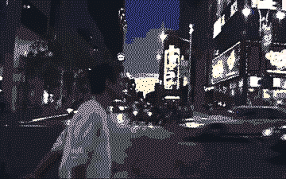
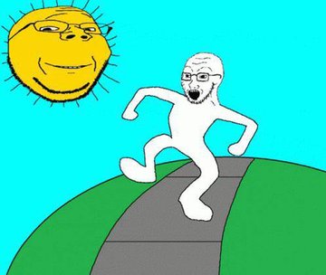
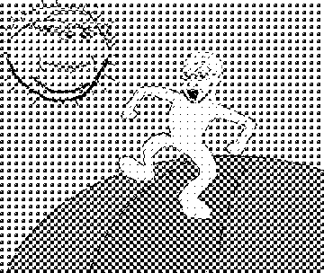
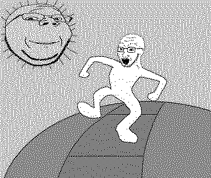
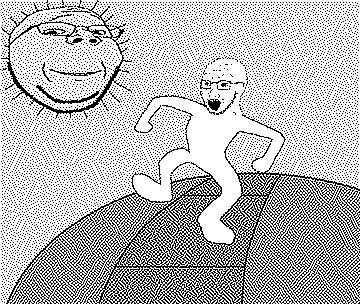
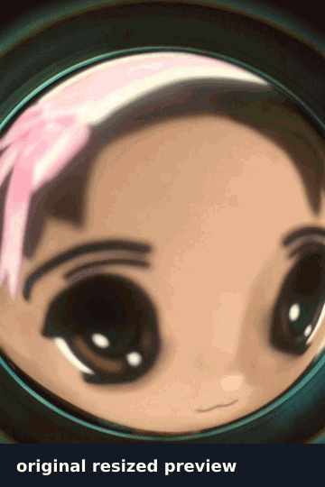

# broccoli-graphics

Small, dependency-free TypeScript graphics primitives for typed-array pixel buffers.

<p align="center">
  
</p>

Dither, quantize, convert to ASCII, render SVG/text, and build lightweight frame pipelines from raw buffers. The core works with `Uint8Array`, `Uint8ClampedArray`, and browser `ImageData.data`.

## Status

Early `0.0.0` package. APIs are implemented and tested, but may change before the first npm release.

## Features

- BT.709 grayscale and luminance helpers.
- Ordered and error-diffusion dithering.
- Palette normalization, nearest-color matching, and quantization.
- ASCII conversion plus plain text, ANSI, and SVG renderers.
- Lazy frame helpers for simple animation pipelines.
- Tree-shakable ESM/CJS exports.
- No runtime dependencies.

## Install

```bash
npm install broccoli-graphics
```

For local development:

```bash
npm install
npm test
npm run build
npm run examples
```

## Quick start

```ts
import {
  createBayerMatrix,
  imageToAscii,
  orderedDither,
  renderAsciiText,
  type PixelBuffer,
} from 'broccoli-graphics';

const width = 4;
const height = 4;
const image: PixelBuffer<Uint8Array> = {
  width,
  height,
  channels: 1,
  data: new Uint8Array([
    0, 64, 128, 255,
    32, 96, 160, 255,
    64, 128, 192, 255,
    96, 160, 224, 255,
  ]),
};

const dithered = orderedDither({
  image,
  matrix: createBayerMatrix(4),
  levels: 2,
});

const ascii = imageToAscii({ image: dithered, ramp: ' @' });
console.log(renderAsciiText(ascii));
```

## Generated image examples

The README assets below are generated deterministically from committed inputs in [`examples/input`](examples/input) with the dev-only Sharp + gifenc pipeline in [`scripts/generate-examples.ts`](scripts/generate-examples.ts); the runtime package remains dependency-free.

| Original | Ordered Bayer | Floyd–Steinberg | Atkinson |
| --- | --- | --- | --- |
|  |  |  |  |
|  |  |  |  |

### Animated conversion stages



The GIF is generated from the same deterministic PNG outputs and labels each stage, giving README readers an at-a-glance view of how ordered dithering and error diffusion change the canonical input.

### ASCII SVG/PNG rendering


The plain text backing file is also committed at [`examples/output/doll-face-ascii.txt`](examples/output/doll-face-ascii.txt), but README previews use rendered SVG/PNG assets so typography, spacing, and per-cell source colors are stable across viewers.

Generate and verify the full asset set with:

```bash
npm run examples
npm run verify:examples
```

The script decodes and resizes the input JPEGs with `sharp`, passes raw RGB buffers into the core typed-array algorithms, writes dithered PNGs, renders a colorized ASCII canvas through `renderAsciiSvg`, converts the animated statement GIF frame-by-frame through the same raw-buffer pipeline, and encodes README GIFs with dev-only `gifenc`.

Core usage mirrors the generation pipeline:

```ts
import sharp from 'sharp';
import {
  DENSE_RAMP,
  createBayerMatrix,
  imageToAscii,
  orderedDither,
  renderAsciiSvg,
} from 'broccoli-graphics';

const { data, info } = await sharp('examples/input/doll-face.jpg')
  .resize({ width: 360 })
  .removeAlpha()
  .raw()
  .toBuffer({ resolveWithObject: true });

const image = { width: info.width, height: info.height, channels: 3 as const, data: new Uint8Array(data) };
const dithered = orderedDither({ image, matrix: createBayerMatrix(8), levels: 2 });
const ascii = imageToAscii({ image: dithered, ramp: DENSE_RAMP, cellWidth: 2, cellHeight: 4 });
const svg = renderAsciiSvg(ascii, {
  background: '#fffaf7',
  foreground: ({ cell, x }) => (cell === ' ' ? undefined : (x < ascii.width / 2 ? '#2d1f1f' : '#b87868')),
});
```

GIF/video encoding stays outside the core package to avoid runtime dependencies. The README conversion-stages GIF is generated by the docs pipeline with dev-only `gifenc`; core frame helpers still produce iterable frame/text sequences that callers can pipe into their preferred GIF, SVG, Canvas, or terminal adapters.

## API overview

All public modules are available from the root export and as subpath exports for tree-shakable imports:

```ts
import { orderedDither } from 'broccoli-graphics/dither/ordered';
import { imageToAscii } from 'broccoli-graphics/ascii/convert';
import { renderAsciiText } from 'broccoli-graphics/render/text';
```

### Luminance

```ts
import { luminance, toGrayscale } from 'broccoli-graphics';

const y = luminance(255, 0, 0); // BT.709 red luma, about 54.2
const physicalY = luminance(128, 128, 128, { transfer: 'linear' }); // sRGB-linear relative luminance, about 55.0
const gray = toGrayscale({ width: 1, height: 1, channels: 3, data: new Uint8Array([255, 0, 0]) });
```

`toGrayscale` supports 1, 3, and 4-channel buffers and optional alpha compositing against a configurable background. The default `encoded` transfer preserves legacy byte-domain luma for common image-processing workflows, while `transfer: 'linear'` converts sRGB bytes to linear light before applying coefficients for physically weighted thresholding or analysis.

### Ordered dithering

```ts
import { createBayerMatrix, orderedDither } from 'broccoli-graphics';

const matrix = createBayerMatrix(4);
const output = orderedDither({ image, matrix, levels: 2 });
const perceptualOutput = orderedDither({ image, matrix, levels: 2, transfer: 'linear' });
```

Bayer matrix sizes must be powers of two. Ordered dithering is stateless per pixel, so it is a good fit for animation frames where deterministic output and low memory overhead matter. RGB/RGBA inputs accept the same luminance options as `toGrayscale`, including custom coefficients, alpha background, and `transfer: 'linear'`.

### Error diffusion

```ts
import {
  atkinsonKernel,
  errorDiffuse,
  floydSteinbergKernel,
  jarvisJudiceNinkeKernel,
  sierraKernel,
  stuckiKernel,
} from 'broccoli-graphics';

const fs = errorDiffuse({ image, kernel: floydSteinbergKernel, levels: 2, serpentine: true });
const atkinson = errorDiffuse({ image, kernel: atkinsonKernel, levels: 2, serpentine: true });
const smoother = errorDiffuse({ image, kernel: sierraKernel, levels: 2, transfer: 'linear' });
```

Built-in kernels cover Floyd-Steinberg, Atkinson, Jarvis-Judice-Ninke, Stucki, Sierra, two-row Sierra, and Sierra Lite. Kernels are plain data (`dx`, `dy`, `weight`) so additional diffusion algorithms can be added without changing the scanline engine. Set `serpentine: true` to alternate scan direction by row and mirror horizontal kernel offsets, reducing one-way streaking artifacts in photographic previews while keeping output deterministic. RGB/RGBA inputs share `toGrayscale` luminance options so ordered and error-diffusion pipelines can use the same brightness model.

### Palette utilities

```ts
import { nearestColor, normalizePalette, quantizeToPalette, quantizeToPaletteIndices } from 'broccoli-graphics';

const palette = normalizePalette([[0, 0, 0], [255, 255, 255]]);
const match = nearestColor({ r: 220, g: 230, b: 240 }, palette);
const rgbLook = quantizeToPalette({ image, palette, outputChannels: 3 });
const indexedLook = quantizeToPaletteIndices({ image, palette });
```

The default distance is squared RGB distance and ties resolve to the first palette entry for deterministic output. `quantizeToPalette` maps 1/3/4-channel image buffers to nearest RGB/RGBA palette colors, while `quantizeToPaletteIndices` emits one-byte palette indices for GIF encoders, indexed image formats, and compact intermediate buffers. Both accept caller-provided output buffers for reuse.

### ASCII conversion and rendering

```ts
import { DENSE_RAMP, imageToAscii, renderAsciiAnsi, renderAsciiSvg, renderAsciiText } from 'broccoli-graphics';

const canvas = imageToAscii({
  image,
  ramp: DENSE_RAMP,
  cellWidth: 2,
  cellHeight: 2,
  contrast: 1.15,
  gamma: 1.1,
});
const text = renderAsciiText(canvas, { repeatX: 2 });
const svg = renderAsciiSvg(canvas, { background: '#0b1020', foreground: '#d7ffe3' });
const colored = renderAsciiAnsi(canvas, {
  foreground: ({ y }) => (y % 2 === 0 ? [120, 255, 120] : [80, 180, 255]),
});
```

`imageToAscii` returns an intermediate `AsciiCanvas` so renderers can stay independent from conversion. It averages rectangular source cells, then applies optional brightness, contrast, and gamma tone mapping before character-ramp lookup. `renderAsciiText` emits plain strings, `renderAsciiAnsi` adds optional ANSI truecolor foreground/background escapes from fixed colors or per-cell callbacks, and `renderAsciiSvg` creates dependency-free standalone SVG previews with fixed or per-cell foreground colors for docs or browser rendering.

### Animation helpers

```ts
import { loopFrames, mapFrames, takeFrames, withFrameDuration } from 'broccoli-graphics';

const timed = withFrameDuration(frames, 80);
const asciiFrames = mapFrames(timed, (frame) => renderAsciiText(imageToAscii({ image: frame })));
const preview = [...takeFrames(loopFrames([...frames], 3), 10)];
```

Frame helpers operate on iterables and are lazy where possible. They are intentionally small so callers can compose them with browser animation loops, terminal renderers, or future GIF/SVG adapters.

## Design notes

- Typed-array first: APIs accept raw pixel buffers and avoid per-pixel objects in hot paths.
- Pure transforms: functions return new buffers/objects unless an output buffer is supplied.
- Small modules: luminance, palette, dithering, ASCII, rendering, and animation helpers are separately importable.
- Dependency-free core: image decoding, GIF/video encoding, Canvas, and terminal orchestration stay outside runtime dependencies.
- License-safe implementation: research notes are summarized in [`docs/research.md`](docs/research.md); implementation code is original.

See [`docs/architecture.md`](docs/architecture.md) for module boundaries and extension points.

## Performance

- Ordered dithering: `O(width * height)`.
- Error diffusion: `O(width * height * kernelSize)` with a `Float32Array` working buffer.
- ASCII conversion: reads each source pixel once while averaging output cells.
- Palette quantization: `O(width * height * paletteSize)`.
- Reusing `output` buffers avoids repeated allocations in loops.

## Development

```bash
npm test       # Vitest unit tests
npm run build  # ESM/CJS/declaration build via tsup
npm run lint   # TypeScript no-emit check
npm run examples
```

The current quality gates pass with 59 unit tests covering core algorithms and edge cases.
