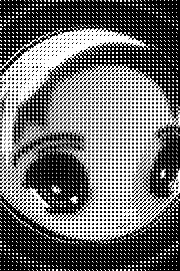
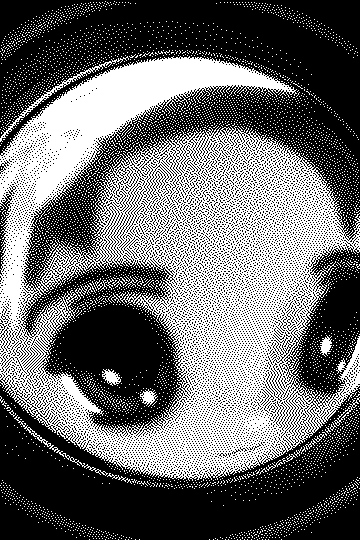
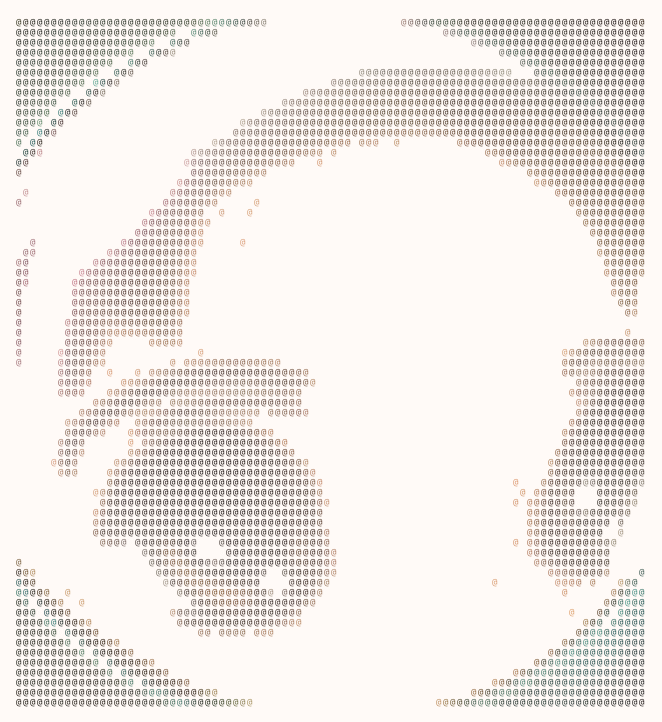

# broccoli-graphics

High-performance lightweight TypeScript graphics primitives for dithering, ASCII art, and simple animation pipelines.

`broccoli-graphics` is designed for projects that already have image-like pixel buffers and want small, composable transforms instead of a heavyweight image-processing runtime. Core functions accept typed arrays such as `Uint8Array`, `Uint8ClampedArray`, or browser `ImageData.data` and return plain buffers/objects that are easy to test and render anywhere.

## Status

Early `0.0.0` package scaffold. The core APIs are implemented and tested, but the public surface may still change before an initial npm release.

## Features

- BT.709 luminance and grayscale conversion for 1/3/4-channel pixel buffers.
- Palette utilities with clamped RGB/RGBA normalization, deterministic nearest-color matching, and image quantization.
- Ordered dithering with generated power-of-two Bayer matrices.
- Error diffusion dithering with data-driven Floyd-Steinberg, Atkinson, JJN, Stucki, and Sierra-family kernels.
- ASCII conversion with configurable character ramps, cell averaging, and invert support.
- Plain text, ANSI, and standalone SVG rendering for ASCII canvases.
- Lazy frame helpers for mapping, looping, timing, and sampling animation pipelines.
- No runtime dependencies.

## Install

```bash
npm install broccoli-graphics
```

For local development in this repository:

```bash
npm install
npm test
npm run build
npm run examples
```

## Quick start

```ts
import {
  createBayerMatrix,
  imageToAscii,
  orderedDither,
  renderAsciiText,
  type PixelBuffer,
} from 'broccoli-graphics';

const width = 4;
const height = 4;
const image: PixelBuffer<Uint8Array> = {
  width,
  height,
  channels: 1,
  data: new Uint8Array([
    0, 64, 128, 255,
    32, 96, 160, 255,
    64, 128, 192, 255,
    96, 160, 224, 255,
  ]),
};

const dithered = orderedDither({
  image,
  matrix: createBayerMatrix(4),
  levels: 2,
});

const ascii = imageToAscii({ image: dithered, ramp: ' @' });
console.log(renderAsciiText(ascii));
```

## Generated image examples

The canonical example input is the committed close-up doll/anime-face photo at [`examples/input/doll-face.jpg`](examples/input/doll-face.jpg). The README assets below are generated deterministically with the dev-only Sharp pipeline in [`scripts/generate-examples.ts`](scripts/generate-examples.ts); the runtime package remains dependency-free.

| Original | Ordered Bayer | Floyd–Steinberg | Atkinson |
| --- | --- | --- | --- |
|  |  |  |  |

### ASCII SVG/PNG rendering



The plain text backing file is also committed at [`examples/output/doll-face-ascii.txt`](examples/output/doll-face-ascii.txt), but README previews use rendered SVG/PNG assets so typography, spacing, and per-cell source colors are stable across viewers.

Generate the full asset set with:

```bash
npm run examples
```

The script decodes and resizes the JPEG with `sharp`, passes raw RGB buffers into the core typed-array algorithms, writes dithered PNGs, renders a colorized ASCII canvas through `renderAsciiSvg`, and rasterizes that SVG to a crisp PNG for README embedding.

Core usage mirrors the generation pipeline:

```ts
import sharp from 'sharp';
import {
  DENSE_RAMP,
  createBayerMatrix,
  imageToAscii,
  orderedDither,
  renderAsciiSvg,
} from 'broccoli-graphics';

const { data, info } = await sharp('examples/input/doll-face.jpg')
  .resize({ width: 360 })
  .removeAlpha()
  .raw()
  .toBuffer({ resolveWithObject: true });

const image = { width: info.width, height: info.height, channels: 3 as const, data: new Uint8Array(data) };
const dithered = orderedDither({ image, matrix: createBayerMatrix(8), levels: 2 });
const ascii = imageToAscii({ image: dithered, ramp: DENSE_RAMP, cellWidth: 2, cellHeight: 4 });
const svg = renderAsciiSvg(ascii, {
  background: '#fffaf7',
  foreground: ({ cell, x }) => (cell === ' ' ? undefined : (x < ascii.width / 2 ? '#2d1f1f' : '#b87868')),
});
```

GIF/video generation is intentionally not part of the core package yet to avoid adding runtime dependencies. The frame helpers produce iterable frame/text sequences that can later be piped into optional GIF, SVG, Canvas, or terminal adapters.

## API overview

All public modules are available from the root export and as subpath exports for tree-shakable imports:

```ts
import { orderedDither } from 'broccoli-graphics/dither/ordered';
import { imageToAscii } from 'broccoli-graphics/ascii/convert';
import { renderAsciiText } from 'broccoli-graphics/render/text';
```

### Luminance

```ts
import { luminance, toGrayscale } from 'broccoli-graphics';

const y = luminance(255, 0, 0); // BT.709 red luma, about 54.2
const gray = toGrayscale({ width: 1, height: 1, channels: 3, data: new Uint8Array([255, 0, 0]) });
```

`toGrayscale` supports 1, 3, and 4-channel buffers and optional alpha compositing against a configurable background.

### Ordered dithering

```ts
import { createBayerMatrix, orderedDither } from 'broccoli-graphics';

const matrix = createBayerMatrix(4);
const output = orderedDither({ image, matrix, levels: 2 });
```

Bayer matrix sizes must be powers of two. Ordered dithering is stateless per pixel, so it is a good fit for animation frames where deterministic output and low memory overhead matter.

### Error diffusion

```ts
import {
  atkinsonKernel,
  errorDiffuse,
  floydSteinbergKernel,
  jarvisJudiceNinkeKernel,
  sierraKernel,
  stuckiKernel,
} from 'broccoli-graphics';

const fs = errorDiffuse({ image, kernel: floydSteinbergKernel, levels: 2 });
const atkinson = errorDiffuse({ image, kernel: atkinsonKernel, levels: 2 });
const smoother = errorDiffuse({ image, kernel: sierraKernel, levels: 2 });
```

Built-in kernels cover Floyd-Steinberg, Atkinson, Jarvis-Judice-Ninke, Stucki, Sierra, two-row Sierra, and Sierra Lite. Kernels are plain data (`dx`, `dy`, `weight`) so additional diffusion algorithms can be added without changing the scanline engine.

### Palette utilities

```ts
import { nearestColor, normalizePalette, quantizeToPalette } from 'broccoli-graphics';

const palette = normalizePalette([[0, 0, 0], [255, 255, 255]]);
const match = nearestColor({ r: 220, g: 230, b: 240 }, palette);
const indexedLook = quantizeToPalette({ image, palette, outputChannels: 3 });
```

The default distance is squared RGB distance and ties resolve to the first palette entry for deterministic output. `quantizeToPalette` maps 1/3/4-channel image buffers to nearest RGB/RGBA palette colors and accepts caller-provided output buffers for reuse.

### ASCII conversion and rendering

```ts
import { DENSE_RAMP, imageToAscii, renderAsciiAnsi, renderAsciiSvg, renderAsciiText } from 'broccoli-graphics';

const canvas = imageToAscii({ image, ramp: DENSE_RAMP, cellWidth: 2, cellHeight: 2 });
const text = renderAsciiText(canvas, { repeatX: 2 });
const svg = renderAsciiSvg(canvas, { background: '#0b1020', foreground: '#d7ffe3' });
const colored = renderAsciiAnsi(canvas, {
  foreground: ({ y }) => (y % 2 === 0 ? [120, 255, 120] : [80, 180, 255]),
});
```

`imageToAscii` returns an intermediate `AsciiCanvas` so renderers can stay independent from conversion. `renderAsciiText` emits plain strings, `renderAsciiAnsi` adds optional ANSI truecolor foreground/background escapes from fixed colors or per-cell callbacks, and `renderAsciiSvg` creates dependency-free standalone SVG previews with fixed or per-cell foreground colors for docs or browser rendering.

### Animation helpers

```ts
import { loopFrames, mapFrames, takeFrames, withFrameDuration } from 'broccoli-graphics';

const timed = withFrameDuration(frames, 80);
const asciiFrames = mapFrames(timed, (frame) => renderAsciiText(imageToAscii({ image: frame })));
const preview = [...takeFrames(loopFrames([...frames], 3), 10)];
```

Frame helpers operate on iterables and are lazy where possible. They are intentionally small so callers can compose them with browser animation loops, terminal renderers, or future GIF/SVG adapters.

## Design notes

- **Typed-array first:** hot paths use linear buffers and index arithmetic to avoid per-pixel object allocation.
- **Pure transforms:** functions accept explicit inputs and return new buffers/objects unless an output buffer is supplied.
- **Small modules:** algorithms are split across luminance, palette, dithering, ASCII, rendering, and animation helpers.
- **Dependency-light core:** image decoding, terminal control, GIF encoding, and Canvas integration are left to consumers or optional future adapters.
- **License-safe implementation:** public research is summarized in [`docs/research.md`](docs/research.md); implementation code is original and does not copy source from reviewed projects.

See [`docs/architecture.md`](docs/architecture.md) for module boundaries and extension points.

## Performance notes

- Ordered dithering is `O(width * height)` time and writes one byte per output pixel for grayscale output.
- Error diffusion is `O(width * height * kernelSize)` and currently uses a full `Float32Array` working buffer for clarity and deterministic tests. A rolling row-buffer implementation can reduce memory later.
- ASCII conversion averages source pixels per output cell. Larger `cellWidth`/`cellHeight` reduce output size but still read each source pixel once.
- Supplying reusable `output` buffers to dither functions avoids repeated allocations in animation loops.

## Development

```bash
npm test       # Vitest unit tests
npm run build  # ESM/CJS/declaration build via tsup
npm run lint   # TypeScript no-emit check
npm run examples
```

The current quality gates pass with 39 unit tests covering core algorithms and edge cases.
